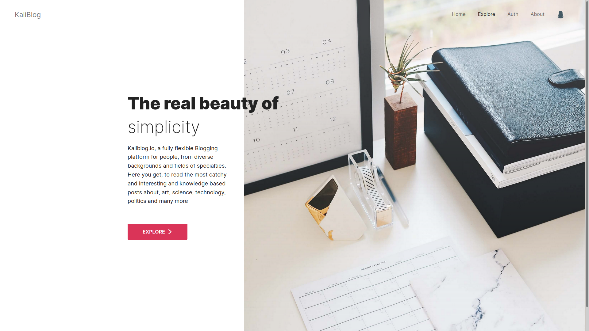
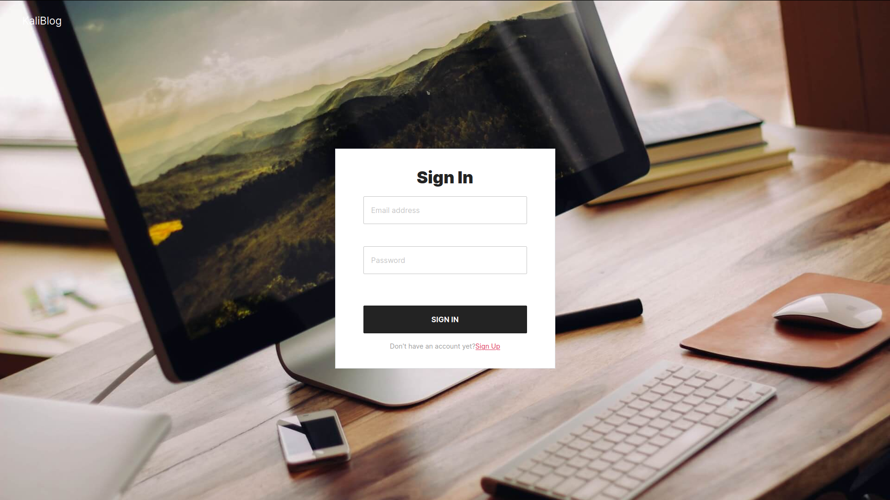
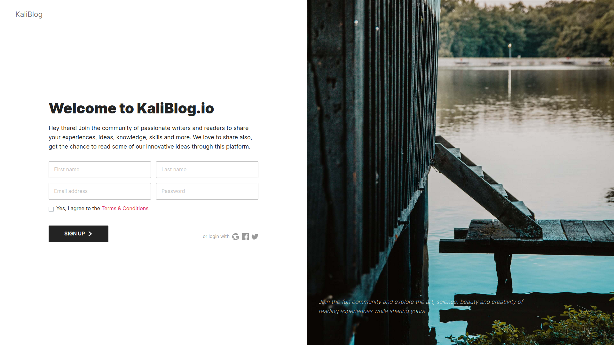
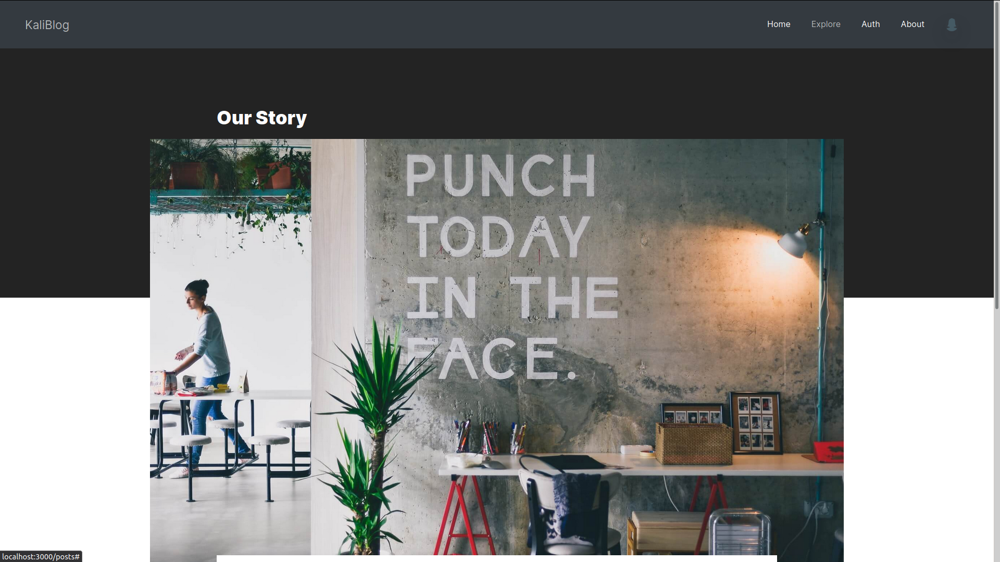
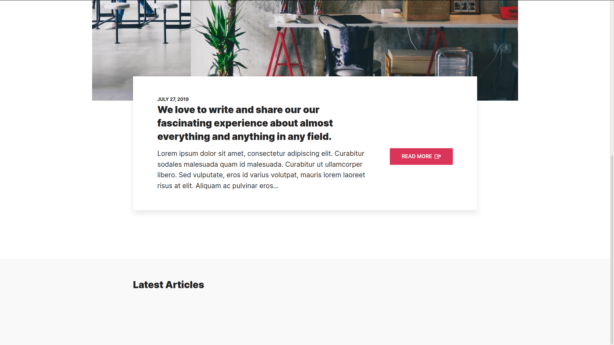
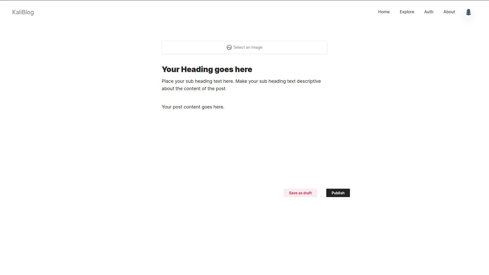

### KaliBlog (written using the MERN stack)

##### Description
implements the most basic features of a web application including 
authentication and features particular to a simple blogging
app; Creating Blog Posts, etc.

##### Features
- WYSIWYG Editor Suppot (EditorJS)
- Bootstrap Styled
- Admin Dashboard (Yet to be implemented)
- User Profile Dashboard (Yet to be implemented)
- Subscription of post (Yet to be implemented)

##### Technology Stack
- Nodejs (Server-side run-time javascript engine)
- ExpressJS (Web Framework)
- React
- MongoDB

**NOTE**: Specific dependency requirements can be found
in the package.json file

##### Issues
- Image Upload not working **bug**
- Saving fetched posts from back end as a state not working **bug**